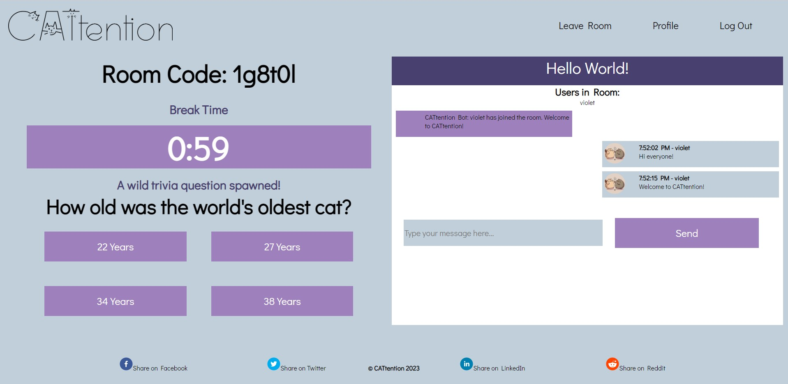
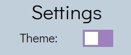
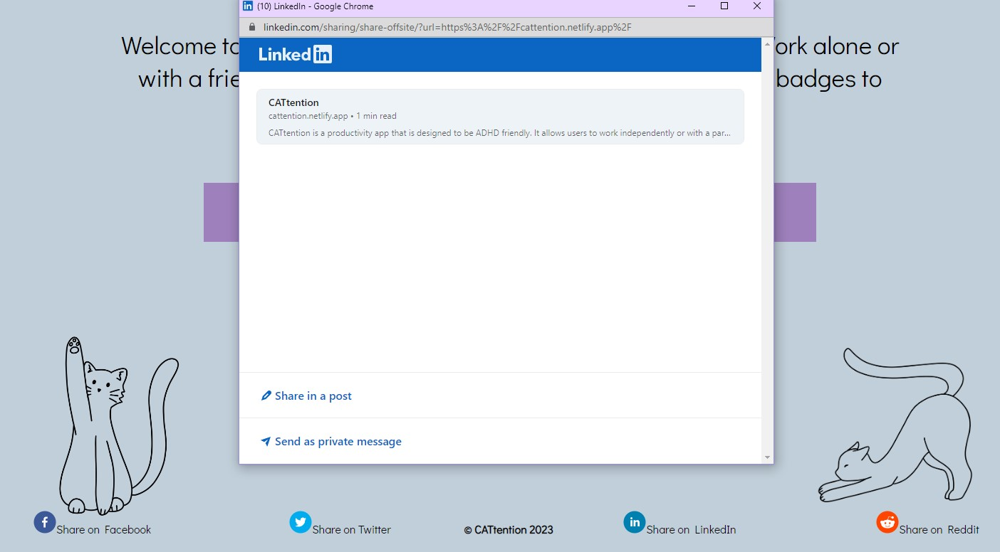
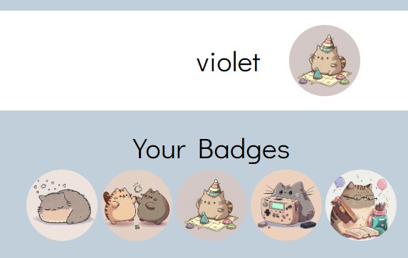

# CATtention

## Description
Welcome to CATtention! This app is a productivity tool for people who struggle with ADHD. With utilization of the pomodoro method, award systems, and collaborative encouragement, users can join a focus oriented study room that reinforces good habits with regular breaks and games.

This application was designed for the University of Washington Coding Bootcamp Final Project to showcase our understanding of the MERN stack. Our application uses SQL to house user information, react for our UI, and Node/Express to handle our server and routes. In building this application, we have learned the importance of team collaboration and how to learn and grow as full-stack developers.

## Table of Contents

- [Installation](#installation)
- [Usage](#usage)
- [Credits](#credits)
- [License](#license)
- [Features](#features) 

## Installation
No installation is required! Simply follow this link to our deployed application: [CATtention](https://cattention.netlify.app/).

If you are interested in viewing our backend repository, it can be viewed here: https://github.com/blaubachs/cattention-api.

## Usage
Usage for this app is quite simple. Upon following the link you are greeted with a landing page prompting you to register. After signing up, you can either create a room or join one a friend has made. Once in the room, the timer starts when the button is pressed. While that timer runs, the user is encouraged to work and chat with others if they have questions or need encouragement. Once the timer is up, they are prompted with a cat themed trivia game. Users can level up their profiles by using the app more and can earn cat badges as they level up to make their profile unique. You can work by yourself or with a couple of friends!

## Credits
- [Ben Laubach](https://github.com/blaubachs): Backend JavaScript, API Endpoints, Frontend JavaScript and React Components 
- [Savannah Miller](https://github.com/VisualViolet): Frontend JavaScript and React Components, CSS, UI/UX
- [Emma Waltho](https://github.com/ewaltho): Figma layout, CSS, UI/UX
- [Alex Hall](https://github.com/alexh3422): Frontend JavaScript and React Components, JavaScript, socket.io integration

## License
MIT License Copyright (c) 2023 CATtention

## Features
Our app features a dark mode for users who either have light sensitivity or would just like a darker theme. To switch it, navigate to your profile and flip the switch labeled "Theme".

---
Like our app? Share it! We've incorporated a package called [React Share](https://www.npmjs.com/package/react-share) that allows you to post about us on your preferred social media site.

---

We reward you for your hard work! As you hit milestones, we give you cat badges that you can set as your profile picture! Simply click on whichever one you'd like to display on your profile.

